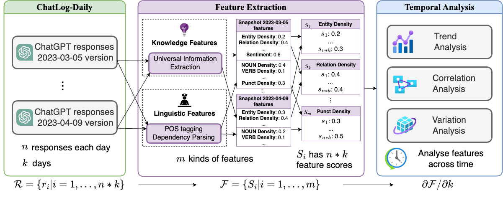

# ⏳ ChatLog: Recording and Analysing ChatGPT Across Time

# Overview
This repository stores data and code for the paper `ChatLog: Recording and Analysing ChatGPT Across Time` 

ChatGPT has achieved great success and can be considered to have acquired an infrastructural status. There are abundant works for evaluating ChatGPT on benchmarks. However, existing benchmarks encounter two challenges: (1) Disregard for periodical evaluation and (2) Lack of fine-grained features. In this paper, we construct ChatLog, an ever-updating dataset with large-scale records of diverse long-form ChatGPT responses for 21 NLP benchmarks from March, 2023 to now. We conduct a comprehensive performance evaluation to find that most capabilities of ChatGPT improve over time except for some abilities, and there exists a step-wise evolving pattern of ChatGPT.  We further analyze the inherent characteristics of ChatGPT by extracting the knowledge and linguistic features. We find some stable features that stay unchanged and apply them on the detection of ChatGPT-generated texts to improve the robustness of cross-version detection. We will continuously maintain our project at  GitHub.




# Data

We release our data at [cloud](https://cloud.tsinghua.edu.cn/d/733684efbec84cbb8c52/).

If you have any questions about the data, please raise a issue

Now the category is as following, you can download them by clicking the link:

- ChatLog-Monthly
  -  [202303.zip](https://cloud.tsinghua.edu.cn/d/733684efbec84cbb8c52/files/?p=%2FChatLog-Monthly%2F202303.zip&dl=1)
  -  [202304.zip](https://cloud.tsinghua.edu.cn/d/733684efbec84cbb8c52/files/?p=%2FChatLog-Monthly%2F202304.zip&dl=1)
  -  [202305.zip](https://cloud.tsinghua.edu.cn/f/710809ac4cfd44119c93/?dl=1)
  -  [202306.zip](https://cloud.tsinghua.edu.cn/f/f4cc4bc1499a45419dea/?dl=1)
  -  [202307.zip](https://cloud.tsinghua.edu.cn/f/a18838f8a91b412d8160/?dl=1)
  -  [202308.zip](https://cloud.tsinghua.edu.cn/f/e97126e262cd4da682f8/?dl=1)
  -  [202309.zip](https://cloud.tsinghua.edu.cn/f/a1b26fd7e7794e838b2e/?dl=1)
  -  [202310.zip](https://cloud.tsinghua.edu.cn/f/5afe93757bbc497fbc5d/?dl=1)
  -  [202311.zip](https://cloud.tsinghua.edu.cn/f/c6550c0091df40d38b9d/?dl=1)
  -  [202312.zip](https://cloud.tsinghua.edu.cn/f/51e66dcaedaf46938c56/?dl=1)
  -  [202401.zip](https://cloud.tsinghua.edu.cn/f/14378f3cf6e94ec0a7b5/?dl=1)
  -  [202402.zip](https://cloud.tsinghua.edu.cn/f/75c70d3af1034da5ac57/?dl=1)
  -  [202403.zip](https://cloud.tsinghua.edu.cn/f/beb370538a284eb6a73e/?dl=1)
  -  [202404.zip](https://cloud.tsinghua.edu.cn/f/1f356f81b3e144208dd1/?dl=1)
- ChatLog-Daily
  - api
    - [everyday_20230305-20230409.zip](https://cloud.tsinghua.edu.cn/d/733684efbec84cbb8c52/files/?p=%2FChatLog-Daily%2Fapi%2Feveryday_20230305-20230409.zip&dl=1)
    - [everyday_20230410-20230508.zip](https://cloud.tsinghua.edu.cn/d/733684efbec84cbb8c52/files/?p=%2FChatLog-Daily%2Fapi%2Feveryday_20230410-20230508.zip&dl=1)
    - [everyday_20230509-20230610.zip](https://cloud.tsinghua.edu.cn/f/eb0a3890bbcb4d46856d/?dl=1)
    - [everyday_20230611-20230708.zip](https://cloud.tsinghua.edu.cn/f/2fa0415b3f0b4bc993af/?dl=1)
    - [everyday_20230709-20230813.zip](https://cloud.tsinghua.edu.cn/f/80fecb1194014790b82e/?dl=1)
    - [everyday_20230814-20230831.zip](https://cloud.tsinghua.edu.cn/f/c3a0ddeee8b14adab26d/?dl=1)
    - [everyday_20230901-20230930.zip](https://cloud.tsinghua.edu.cn/f/215dde0578884aaa8867/?dl=1)
    - [everyday_20231001-20231113.zip](https://cloud.tsinghua.edu.cn/f/e8f388c48a004c34a6aa/?dl=1)
    - [everyday_20231114-20231228.zip](https://cloud.tsinghua.edu.cn/f/0cf04e4ac3dd4f87a03d/?dl=1)
    - [everyday_20240109-20240209.zip](https://cloud.tsinghua.edu.cn/f/126faff2d49a4ce0b25e/?dl=1)
    - [everyday_20240210-20240313.zip](https://cloud.tsinghua.edu.cn/f/316b4c8ae20f46dca015/?dl=1)
    - [everyday_20240314-20240422.zip](https://cloud.tsinghua.edu.cn/f/1ed9cd3bf01d4eb4a688/?dl=1)
    - [everyday_20240423-20240527.zip](https://cloud.tsinghua.edu.cn/f/6ee2f807e59f4b52a803/?dl=1)
  - open
    - [before0301.zip](https://cloud.tsinghua.edu.cn/d/733684efbec84cbb8c52/files/?p=%2FChatLog-Daily%2Fopen%2Fbefore0301.zip&dl=1)
  - processed_csv
    - [avg_HC3_all_pearson_corr_feats.csv](https://cloud.tsinghua.edu.cn/d/733684efbec84cbb8c52/files/?p=%2FChatLog-Daily%2Fprocessed_csv%2Favg_HC3_all_pearson_corr_feats.csv&dl=1)
    - [avg_HC3_knowledge_pearson_corr_feats.csv](https://cloud.tsinghua.edu.cn/d/733684efbec84cbb8c52/files/?p=%2FChatLog-Daily%2Fprocessed_csv%2Favg_HC3_knowledge_pearson_corr_feats.csv&dl=1)

Every `zip` file contains some `jsonl` files and each json object is as the format:

| column name:  | id       | source_type                                      | source_dataset                    | source_task                                    | q                                                          | a                    | language         | chat_date                       | time                                               |
| ------------- | -------- | ------------------------------------------------ | --------------------------------- | ---------------------------------------------- | ---------------------------------------------------------- | -------------------- | ---------------- | ------------------------------- | -------------------------------------------------- |
| introduction: | id       | type of the source: from open-access dataset/api | dataset of the question come from | specific task name，such as sentiment analysis | question                                                   | response of  ChatGPT | language         | The time that ChatGPT responses | The time that the data is stored into our database |
| example       | 'id': 60 | 'source_type': 'open'                            | 'source_dataset': 'ChatTrans'     | 'source_task': 'translation'                   | 'q': 'translate this sentence into Chinese: Good morning', | 'a': '早上好',       | 'language': 'zh' | 'chat_date': '2023-03-03',      | 'time': '2023-03-04 09:58:09',                     |

The ChatLog-Monthly and ChatLog-Daily will be continuously updated.

# Analysis Code

For processsing data from 20230305 to 20230409, please use v1 version's shells.
For processsing data after 20230410, please use v2 version's shells.

1. For extracting all the knowledge and linguistic features, run:

```
sh shells/process_new_data_v1.sh
```

2. For analyzing features and calculating variation, run:

```
sh shells/analyse_var_and_classify_across_time_v1.sh
```

3. Use LightGBM that ensembles the features with RoBERTa to train a robust ChatGPT detector, run:

```
sh shells/lgb_train_v1.sh
```

4. For trend and correlation analysis, first dumping knowledge features into `avg_HC3_knowledge_pearson_corr_feats.csv`

```
sh shells/draw_knowledge_feats_v1.sh
```

5. Then dump other linguistic features into `avg_HC3_all_pearson_corr_feats.csv`

```
sh shells/draw_eval_corr_v1.sh
```

6. Finally, we can draw heatmaps and lineplots for trend and correlation analysis:

   - Put the dumped  `avg_HC3_knowledge_pearson_corr_feats.csv` and  `avg_HC3_all_pearson_corr_feats.csv` under the `./shells` folder
   - Then use `./shells/knowledge_analysis.ipynb` and `./shells/temporal_analysis.ipynb` to draw every figure.

   
